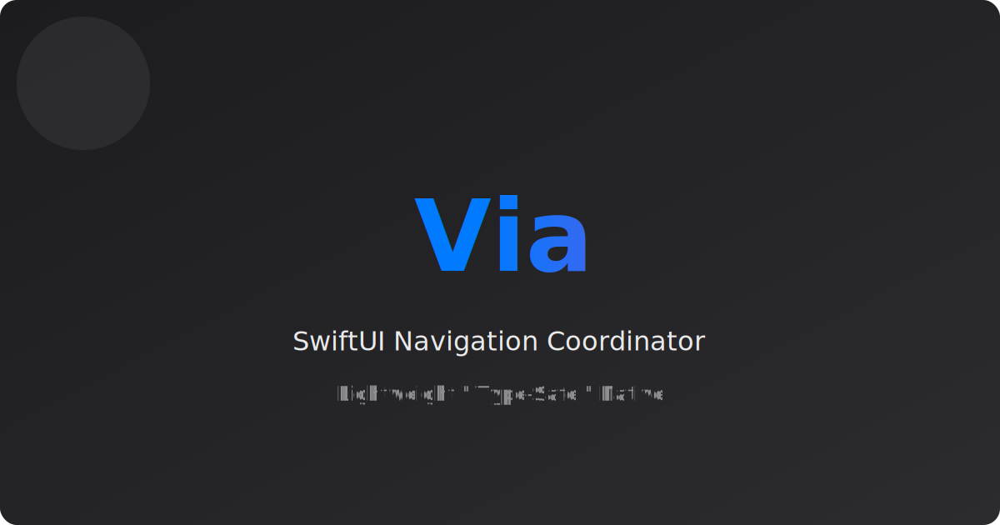

<p align="center">
  
</p>

<p align="center">
  <strong>Via</strong> is a lightweight coordinator abstraction for SwiftUI’s <code>NavigationStack</code>.
  <br>
  <em>Simplify your navigation flow by separating state from view construction.</em>
</p>

# ViaNavigation

## How to use the component

### Install (Swift Package Manager)

- **Package URL**: `https://github.com/israman30/Via-Navigation.git`
- **Product**: `Via`

#### Setup notes

- **Xcode**: `File → Add Package Dependencies…` → paste the URL → select product `Via`.
- **`Package.swift`**: add the package and the `Via` product to your target dependencies:

```swift
// swift-tools-version: 6.3
import PackageDescription

let package = Package(
    name: "MyApp",
    platforms: [.iOS(.v16)],
    dependencies: [
        .package(url: "https://github.com/israman30/Via-Navigation.git", branch: "main")
    ],
    targets: [
        .target(
            name: "MyApp",
            dependencies: [
                .product(name: "Via", package: "via-navigation")
            ]
        )
    ]
)
```

### Quick start

1) Define a typed route model (usually an `enum`) that conforms to `Hashable`.
2) Subclass `ViaNavigator<Route>` and override:
   - `rootView()` (your entry view)
   - `destinationView(for:)` (one `switch` case per route)
3) Host the coordinator once using `ViaNavigatorView(coordinator:)`.

```swift
import SwiftUI
import Via

enum AppRoute: Hashable {
    case details(id: String)
    case settings
}

@MainActor
final class AppCoordinator: ViaNavigator<AppRoute> {
    override func rootView() -> AnyView {
        AnyView(HomeView())
    }

    override func destinationView(for route: AppRoute) -> AnyView {
        switch route {
        case .details(let id):
            AnyView(DetailsView(id: id))
        case .settings:
            AnyView(SettingsView())
        }
    }
}

struct AppRoot: View {
    var body: some View {
        ViaNavigatorView(coordinator: AppCoordinator())
    }
}

struct HomeView: View {
    @EnvironmentObject private var coordinator: AppCoordinator

    var body: some View {
        List {
            Button("Open details") { 
                coordinator.navigate(to: .details(id: "A1")) 
            }
            Button("Settings") { 
                coordinator.navigate(to: .settings) 
            }
        }
        .navigationTitle("Home")
    }
}
```

### UIKit hosting (UINavigationController + SwiftUI screens)

If your app shell is UIKit (or you’re migrating incrementally), you can host the same coordinator in a `UINavigationController` using `ViaNavigatorViewController`.

- **Coordinator → UIKit**: updates to `coordinator.path` push/pop view controllers.
- **UIKit → Coordinator**: back button and interactive swipe-back are observed and mirrored into `coordinator.path`.
- **SwiftUI screens still work**: screens receive your concrete coordinator via `@EnvironmentObject` (same as the SwiftUI-only host).

> Requires **iOS 16+** (same minimum as `NavigationStack`).

```swift
import UIKit
import Via

final class SceneDelegate: UIResponder, UIWindowSceneDelegate {
    var window: UIWindow?

    func scene(
        _ scene: UIScene,
        willConnectTo session: UISceneSession,
        options connectionOptions: UIScene.ConnectionOptions
    ) {
        guard let windowScene = scene as? UIWindowScene else { return }
        let window = UIWindow(windowScene: windowScene)

        window.rootViewController = ViaNavigatorViewController(coordinator: AppCoordinator())

        self.window = window
        window.makeKeyAndVisible()
    }
}
```

#### Minimal UIKit coordinator example

This is the same coordinator style as the SwiftUI host; only the root host changes.

```swift
import SwiftUI
import Via

enum AppRoute: Hashable { case details(id: String) }

@MainActor
final class AppCoordinator: ViaNavigator<AppRoute> {
    override func rootView() -> AnyView {
        AnyView(HomeView())
    }

    override func destinationView(for route: AppRoute) -> AnyView {
        switch route {
        case .details(let id):
            AnyView(Text("Details \(id)"))
        }
    }
}

struct HomeView: View {
    @EnvironmentObject private var coordinator: AppCoordinator

    var body: some View {
        List {
            Button("Push details") { coordinator.navigate(to: .details(id: "A1")) }
            Button("Pop") { coordinator.navigateBack() }
        }
        .navigationTitle("Home")
    }
}
```

#### Implementation notes

- **Single source of truth**: your `Route` type is the API for navigation; the coordinator is where routes become views.
- **Where to call navigation**: views should call `navigate(...)` / `navigateBack(...)` on the coordinator instead of manually manipulating a `NavigationPath`.
- **Testability**: coordinators make it easier to unit-test navigation decisions (route selection) separately from view layout.

## Scenarios

### Auth flow (login → signup → authenticated root)

Use auth state to decide **which root screen** to show, while your `Route` models screens that are pushed on top of that root.

Working demo: `Via/Examples/AuthImplementation.swift` (`AuthFlowRootView`).

```swift
import SwiftUI
import Via
import Combine

private enum AuthRoute: Hashable {
    case signup 
    case login
}

@MainActor
private final class AuthCoordinator: ViaNavigator<AuthRoute> {
    @Published private(set) var isAuthenticated = false

    override func rootView() -> AnyView {
        isAuthenticated ? AnyView(HomeView()) : AnyView(LoginView())
    }

    override func destinationView(for route: AuthRoute) -> AnyView {
        switch route {
        case .signup: 
            AnyView(SignupView())
        case .login:
            AnyView(LoginView())
        }
    }

    func finishAuthentication() {
        isAuthenticated = true
        navigateToRoot(animated: false)
    }
}
```

### Parent and child views (root + pushed screens)

Use routes to push child screens, and keep the mapping in `destinationView(for:)`.

Working demo: `Via/Examples/SmapleView.swift` (`AppSampleRootView`).

```swift
private enum Route: Hashable {
    case details(id: String)
    case settings
}

@MainActor
private final class RootCoordinator: ViaNavigator<Route> {
    override func rootView() -> AnyView { 
        AnyView(Main()) 
    }

    override func destinationView(for route: Route) -> AnyView {
        switch route {
        case .details(let id): 
            AnyView(DetailsView(id: id))
        case .settings: 
            AnyView(SettingsView())
        }
    }
}
```

### TabView (one navigation stack per tab)

When your UI uses `TabView`, it’s common to want each tab to keep its own independent navigation stack.

`ViaTabNavigator<Tab, Route>` provides:

- **Per-tab stacks**: `paths[tab]` stores a separate `[Route]` for each tab.
- **Selected tab binding**: `selectedTab` binds to `TabView(selection:)`.
- **Convenient APIs**: push/pop on the current tab, or target another tab (optionally switching tabs first).

Working demo: `Via/Examples/TabSampleView.swift` (`TabSampleRootView`).

```swift
import SwiftUI
import Via

enum AppTab: Hashable { 
    case feed, settings 
}

enum AppRoute: Hashable { 
    case details(id: String), about 
}

@MainActor
final class AppCoordinator: ViaTabNavigator<AppTab, AppRoute> {
    init() {
        super.init(tabs: [.feed, .settings], selectedTab: .feed)
    }

    override func rootView(for tab: AppTab) -> AnyView {
        switch tab {
        case .feed: 
            AnyView(FeedView())
        case .settings: 
            AnyView(SettingsView())
        }
    }

    override func destinationView(for route: AppRoute) -> AnyView {
        switch route {
        case .details(let id): 
            AnyView(DetailsView(id: id))
        case .about: 
            AnyView(AboutView())
        }
    }

    override func tabItem(for tab: AppTab) -> AnyView {
        switch tab {
        case .feed: 
            AnyView(Label("Feed", systemImage: "list.bullet"))
        case .settings: 
            AnyView(Label("Settings", systemImage: "gearshape"))
        }
    }
}

struct AppRoot: View {
    var body: some View {
        ViaTabNavigatorView(coordinator: AppCoordinator())
    }
}
```

## Common navigation APIs

From any view that has the coordinator via `@EnvironmentObject`:

- **Push**: `navigate(to:animated:)`
- **Pop 1**: `navigateBack(animated:)`
- **Pop N**: `navigateBack(steps:animated:)`
- **Pop to a specific route**: `popTo(_:animated:)`
- **Pop to root**: `navigateToRoot(animated:)`
- **Replace stack / deep link**: `setPath(_:animated:)` and `replace(with:animated:)`

## Examples / Preview

This repo includes a demo target you can run in Xcode:

- **Scheme/target**: `ViaDemoUI`
- **Screens**:
  - `Via/Examples/SmapleView.swift` (parent/child navigation)
  - `Via/Examples/AuthImplementation.swift` (auth flow)
  - `Via/Examples/UIKitImplementationSample.swift` (UIKit host + auth + tabs + modal present)

Open a file above and run its `#Preview`.

## Tech stack

- **Language**: Swift 6 (Swift tools: 6.3)
- **UI**: SwiftUI (`NavigationStack`)
- **State**: Combine (`@Published`)
- **Distribution**: Swift Package Manager

## Supported versions

Defined in `Via/Package.swift`:

- **iOS**: 16+
- **macOS**: 13+
- **Swift tools**: 6.3 (use an Xcode toolchain that supports Swift 6.3)

## Contribution policy

Contributions are welcome.

- **Before you start**: open an issue describing the bug/feature and the intended approach.
- **Branching**: create a feature branch from `main` (or the default branch).
- **Code style**: keep changes small and focused; prefer clarity over cleverness.
- **Examples**: if you change the navigation API, update the demos in `Via/Examples/`.
- **Verification**: ensure the package builds and the previews in `ViaDemoUI` still work.
- **PRs**: include a short summary and a minimal test plan (even if it’s “Run Preview X”).

## License

There is currently **no license file** in this repository. Until a license is added, reuse and redistribution are not granted by default (see copyright below).

## Copyright

Copyright (c) 2026 Israel Manzo and contributors. All rights reserved.